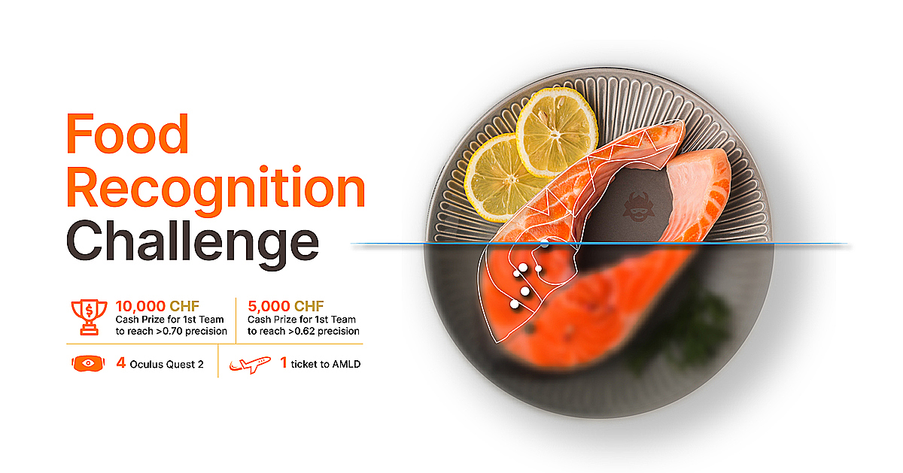
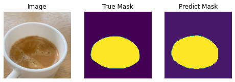
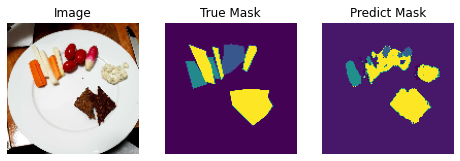
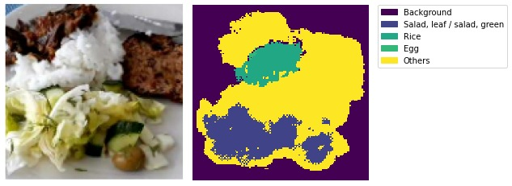

# FoodRecognitionChallenge

Food recognition is an interesting and active topic nowadays. It could be useful for people to use their mobile, taking photos of what they consume, in order to monitor their food intake. Food tracking can be not only of personal interest but it can also have a medical relevance. The use of such a program requires the ability of it to recognize and segment food from images and eventually also to estimate the dimensions of it.
One of the hardest task is that we should be able to recognize and segment from photos taken by common people and not from professional photographers. Accordingly to it food may be overlapping and mixed up, photos may be not perfectly on focus or they may show only a part of the dish.
Our approach is to use convolutional neural networks to segment images.

## DEMO 

  

## Requirements

* [Python](https://www.python.org/)
* [TensorFlow](https://www.tensorflow.org/)
* [Keras](https://www.keras.io/)
* [OpenCV](https://www.opencv.org/)
* [Numpy](https://numpy.org/)
* [Matplotlib](https://matplotlib.org/)
* [Segmentation Models](https://github.com/qubvel/segmentation_models.org/)
* [PyCOCOTools](https://github.com/cocodataset/cocoapi/tree/master/PythonAPI/pycocotools)

## Results Visualization
#### Binary Class Segmentation

  

#### Multi-Class Segmentation

  

#### Class Recognition

  

